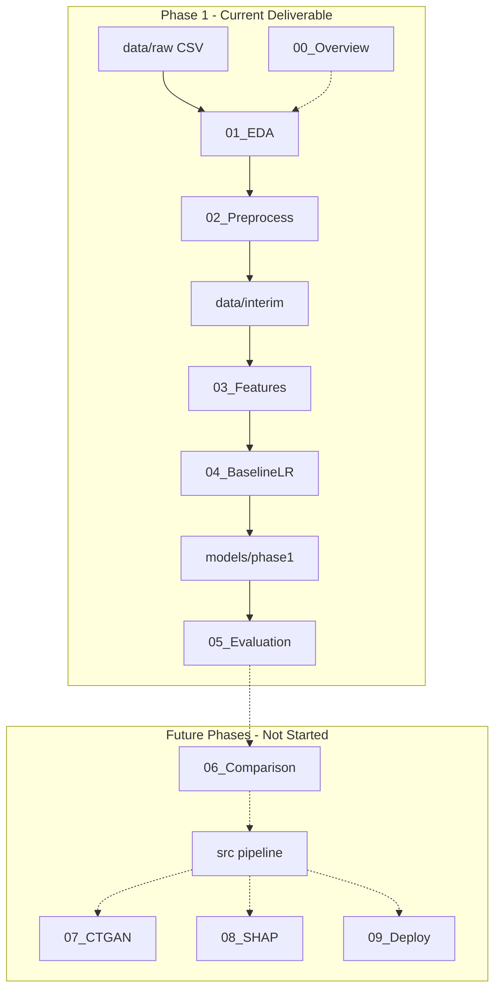
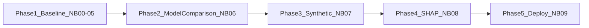

# Project Guide — Employee Attrition Prediction

Single source of truth for project vision, architecture, workflows, and future phases. [README.md](README.md) covers installation and getting started only.

---

## 1. Project Vision

Organizations lose talent, knowledge, and productivity when employees leave unexpectedly. This project builds a data-driven attrition prediction system that:

1. Starts with an **interpretable baseline model** HR stakeholders can audit (Phase 1).
2. Evolves toward **advanced models, synthetic data, explainability, and deployment** via a modular `src/` pipeline (Phases 2–5).

**Design principle:** Phase 1 notebooks are self-contained and import only from `notebooks/_shared/`, not `src/`. Future phases adopt pipeline modules while preserving Phase 1 conventions.

---

## 2. Business Problem

When employees attrit, organizations face recruitment costs (often 50–200% of annual salary for specialized roles), productivity loss, and institutional knowledge drain. HR teams typically respond reactively through exit interviews.

A **proactive attrition prediction system** enables HR to:

- Flag high-risk employees before they leave
- Prioritize retention budgets
- Investigate root causes with data-driven evidence

**Prediction task:** Given an employee's HR profile, predict whether they will **attrit** (`Attrition = Yes`) or **remain** (`Attrition = No`).

---

## 3. Repository Architecture

```
Employee-Attrition Project/
├── notebooks/          # Phase 1 case study (00–05)
│   └── _shared/        # Paths, plotting theme, I/O helpers
├── data/
│   ├── raw/            # Source CSV
│   └── interim/        # Notebook artifacts (generated)
├── models/phase1/      # Baseline model artifact (generated)
├── src/                # Future pipeline modules (Phase 2+ scaffolding)
├── configs/            # Hydra configuration (future phases)
├── reports/            # Pipeline reports (generated, future phases)
├── tests/
├── docker/             # Container deployment (future)
├── Makefile
├── pyproject.toml
└── requirements.txt
```

| Path | Purpose |
|------|---------|
| `notebooks/00–05` | **Phase 1 deliverable** — complete notebook series |
| `notebooks/_shared/` | Shared helpers: config, plotting, I/O (not core ML logic) |
| `data/interim/` | Train/test splits and feature-enriched CSVs between notebooks |
| `models/phase1/` | Persisted baseline sklearn Pipeline |
| `src/` | Scaffolding for future automated pipeline — **not required for Phase 1** |
| `configs/` | Hydra YAML wiring future pipeline stages |

Generated artifacts are gitignored and produced at runtime.

---

## 4. Notebook Architecture

Each Phase 1 notebook follows a consistent report structure:

| Section | Purpose |
|---------|---------|
| Title | Notebook name and phase |
| Executive Summary | One-paragraph overview |
| Objectives | Learning and deliverable goals |
| Expected Outputs | Artifacts produced |
| Required Inputs | Prerequisites and paths |
| Methodology | Analytical approach |
| Implementation | Executable code (core ML logic visible in notebooks) |
| Observations | Factual findings from outputs |
| Business Interpretation | HR meaning of results |
| Conclusion | Stage summary |
| Future Connection | Bridge to the next notebook |

| Notebook | Status | Focus |
|----------|--------|-------|
| **00 — Project Overview** | Complete | Introduction, roadmap, repository guide |
| **01 — Data Understanding & EDA** | Complete | Load, quality, visual EDA, business insights |
| **02 — Data Preprocessing** | Complete | Clean, column selection, stratified split |
| **03 — Feature Engineering** | Complete | 8 HR features with fixed domain bins |
| **04 — Baseline Logistic Regression** | Complete | Dummy + LR training, model persistence |
| **05 — Model Evaluation** | Complete | Metrics, curves, coefficients, recommendations |

---

## 5. Execution Flow

### Notebook artifact chain

1. **00** — No artifacts (introduction only)
2. **01** — Reads `data/raw/*.csv`; no writes
3. **02** — Writes `data/interim/train.csv`, `test.csv`
4. **03** — Reads interim splits; writes `train_features.csv`, `test_features.csv`
5. **04** — Reads feature splits; writes `models/phase1/baseline_pipeline.joblib`
6. **05** — Reads model + test set; produces evaluation outputs in-notebook

### Commands

```bash
make setup && make install
make phase1        # Execute notebooks 00–05 in order
```

Individual steps: `make overview`, `make eda`, `make preprocess`, `make features`, `make baseline`, `make evaluate`.

**Reproducibility:** `RANDOM_STATE = 42` for splitting and model fitting.

---

## 6. ML Lifecycle

| Stage | Phase 1 (Notebooks) | Future (`src/` pipeline) |
|-------|---------------------|--------------------------|
| Data ingestion | Raw CSV in notebooks | `src/utils/data_loader.py` |
| EDA | Notebook 01 | `src/eda/` |
| Preprocessing | Notebook 02 | `src/preprocessing/` |
| Feature engineering | Notebook 03 | `src/features/` |
| Training | Notebook 04 (logistic regression) | `src/training/` (multi-model) |
| Evaluation | Notebook 05 | `src/evaluation/` |
| Synthetic data | — | `src/synthetic/` (CTGAN) |
| Explainability | Coefficients (NB05) | `src/explainability/` (SHAP) |
| Deployment | — | `src/deployment/` |

---

## 7. Workflow Diagram



---

## 8. Current Milestone

**Phase 1 — Baseline Model** is complete. The notebook series (`00`–`05`) is the academic deliverable.

| Phase | Notebooks | `src/` Modules | Status |
|-------|-----------|----------------|--------|
| 1 | 00–05 | — | **Complete** |
| 2 | 06 | `training/`, `preprocessing/` | Planned |
| 3 | 07 | `synthetic/`, `validation/` | Planned |
| 4 | 08 | `explainability/` | Planned |
| 5 | 09 | `deployment/`, `docker/` | Planned |



---

## 9. Future Roadmap

The `src/` directory contains scaffolding (EDA, training, synthetic, explainability, deployment) to accelerate future development. Presence of this code does **not** indicate those phases are complete.

### Planned pipeline entry points (not in Makefile)

When implemented, future phases will use:

- `python -m src.eda.run`
- `python -m src.features.engineer`
- `python -m src.training.train`
- `python -m src.synthetic.train`
- `python -m src.evaluation.evaluate`
- `python -m src.deployment.api.main`

---

## 10. Design Decisions

1. **Phase 1 notebooks are self-contained** — import only `notebooks/_shared/`, not `src/`.
2. **Core ML logic visible in notebooks** — preprocessing pipeline, feature engineering, training, and evaluation metrics are implemented in notebook code cells; `_shared/` holds paths, plotting theme, and I/O helpers only.
3. **Fixed-bin feature engineering** — domain rules with no data-driven quantiles; leakage-safe.
4. **Preprocessing inside sklearn Pipeline** — `StandardScaler` and `OneHotEncoder` fit on train only (Notebook 04).
5. **Stratified 80/20 split** — preserves class ratio in train and test (Notebook 02).
6. **Balanced class weights** — addresses 16% attrition rate without SMOTE in Phase 1.
7. **Recall prioritization** — false negatives (missed leavers) carry higher HR cost.
8. **Interim CSV artifacts** — enable independent notebook execution with explicit dependencies.

---

## 11. Dataset Information

| Property | Value |
|----------|-------|
| Source | [Kaggle — IBM HR Analytics Attrition Dataset](https://www.kaggle.com/datasets/pavansubhasht/ibm-hr-analytics-attrition-dataset) |
| File | `data/raw/WA_Fn-UseC_-HR-Employee-Attrition.csv` |
| Rows | 1,470 employees |
| Columns | 35 attributes |
| Target | `Attrition` (Yes / No) |
| Positive class rate | ~16% |

**Feature categories:** Demographics, job characteristics, compensation, tenure, satisfaction (Likert 1–4), identifiers/constants (dropped during preprocessing).

**Download:** Place the CSV manually at the path above.

---

## 12. Phase 1 Results (Test Set)

From Notebooks 04–05 (80/20 stratified split, logistic regression, `class_weight=balanced`):

| Metric | Value |
|--------|-------|
| ROC-AUC | ~0.809 |
| Recall | ~0.681 |
| Precision | ~0.381 |
| F1 Score | ~0.489 |
| Accuracy | ~0.772 |

**Note:** The future `src/` pipeline uses a different split (70/15/15) and SMOTE — metrics may differ. That path is separate from Phase 1.

---

## 13. Makefile Usage

| Command | Description |
|---------|-------------|
| `make setup` | Create virtual environment |
| `make install` | Install package with dev dependencies |
| `make notebook` | Launch JupyterLab in `notebooks/` |
| `make overview` | Execute Notebook 00 |
| `make eda` | Execute Notebook 01 |
| `make preprocess` | Execute Notebook 02 |
| `make features` | Execute Notebook 03 |
| `make baseline` | Execute Notebook 04 |
| `make evaluate` | Execute Notebook 05 |
| `make phase1` | Execute all Phase 1 notebooks |
| `make lint` | Run ruff linter |
| `make test` | Run pytest with coverage |
| `make clean` | Remove caches and generated outputs |

---

## 14. Development Workflow

```bash
make install
make lint
make test
make phase1    # Validate notebook series before submission
```

---

## 15. Hardware Execution Policy

Compute backends are selected **automatically at runtime** via `src/utils/hardware.py` (for future pipeline modules only):

| Library | Selection |
|---------|-----------|
| LogisticRegression | CPU |
| pandas, plotting, Phase 1 notebooks | CPU |
| XGBoost | CUDA or CPU via probe (Phase 2+) |
| LightGBM | GPU or CPU via probe (Phase 2+) |
| CatBoost | GPU or CPU via probe (Phase 2+) |
| CTGAN (SDV) | GPU when available (Phase 3+) |

**Rules:**

- No code changes required to switch hardware.
- Hardware details are **internal** — not displayed in notebooks or documentation.
- Phase 1 notebooks use sklearn only (CPU).

---

## 16. Future Expansion Plan

| Component | Phase | Hardware |
|-----------|-------|----------|
| Random Forest / XGBoost / LightGBM / CatBoost | 2 | Auto GPU/CPU via `hardware.py` |
| CTGAN synthetic data | 3 | Auto GPU when available |
| SHAP explainability | 4 | CPU |
| FastAPI + Streamlit + Docker | 5 | CPU inference |

---

## 17. References

- [IBM HR Analytics Attrition Dataset (Kaggle)](https://www.kaggle.com/datasets/pavansubhasht/ibm-hr-analytics-attrition-dataset)
- [scikit-learn Documentation](https://scikit-learn.org/stable/)
- [SDV — Synthetic Data Vault](https://docs.sdv.dev/) (future Phase 3)
- [SHAP Documentation](https://shap.readthedocs.io/) (future Phase 4)

---

*Last updated: June 2026 — Phase 1 notebook series complete*
